<!--
  ErfanShm Profile README
  Brand: terminal / evening aesthetic · matches erfanshm.com
-->

<p align="center">
  
</p>

<p align="center">
  <a href="https://erfanshm.com">
    
  </a>
  <a href="mailto:erfanshm12@gmail.com">
    
  </a>
  <a href="https://www.linkedin.com/in/erfan-shafiee-moghadam-">
    
  </a>
  
</p>

<p align="center">
  <a href="https://readme-typing-svg.demolab.com?font=Fira+Code&weight=600&size=22&duration=3200&pause=900&color=3DD68C&center=true&vCenter=true&multiline=false&width=720&height=40&lines=AI+Systems+Architect;Production+RAG+%26+Multi-Agent+Workflows;Knowledge+Graphs+%C2%B7+LangGraph+%C2%B7+FastAPI;I+turn+complex+AI+into+enterprise+products">
    
  </a>
</p>

<p align="center">
  
</p>

## `whoami`

I turn complex AI concepts into **enterprise-ready products**.

As a product-minded **AI Systems Architect**, I design Production RAG platforms and multi-agent workflows that solve real business problems — not demos. My work spans UGAP, UTEX, and KNIGHT: systems meant to ship, scale, and become a growth lever.

I thrive on ambiguity. If you need a visionary idea turned into a reliable, market-ready AI solution — let's talk.

<p align="center">
  
</p>

---

## Featured work

| # | Project | What it is | Stack / impact |
|:-:|:--------|:-----------|:---------------|
| 01 | **[KNIGHT](https://github.com/ErfanShm/knight-mcq)** | Knowledge-graph framework for verifiable multi-hop MCQ evaluation · CPAL 2026 · PyPI `knight-mcq` | Neo4j · RAG eval · LLMs · [arXiv:2602.20135](https://arxiv.org/abs/2602.20135) |
| 02 | **UGAP** | Unified Generative AI Platform — production RAG with 7+ vector collections & live token streaming | FastAPI · LangChain · WebSockets · PostgreSQL · Redis |
| 03 | **UTEX** | Smart editorial AI platform — unified API gateway orchestrating multi-modal LLM workflows | 35+ endpoints · credit billing · RBAC |
| 04 | **[ChatDoc](https://github.com/ErfanShm/ChatDoc)** | Document RAG chatbot — upload docs, query with grounded answers | RAG · retrieval + generation |
| 05 | **[Sentiment & Emotion App](https://github.com/ErfanShm/sentiment-emotion-analysis-app)** | DistilBERT sentiment tooling with Streamlit / Gradio UIs | NLP · Hugging Face · FastAPI |

<p align="center">
  <a href="https://github.com/ErfanShm?tab=repositories">
    
  </a>
  <a href="https://erfanshm.com">
    
  </a>
</p>

---

## Career

```bash
# professional path
2025–2026  AI Engineer & RAG Architect     @ MemaranSoft
2024–2026  AI Software Developer           @ SmartEra Organization
2024       GenAI Intern                    @ Asr Gooyesh Pardaz
2021–2023  System Analyst & Front-End Dev  @ Barsa Novin Ray & Rismun
```

<details>
<summary><strong>MemaranSoft — AI Engineer & RAG Architect</strong> · Apr 2025 – Apr 2026</summary>
<br/>

- Led architecture for enterprise AI platforms during the company’s shift to AI-driven products.
- **UGAP:** production RAG with 7+ specialized vector collections, adaptive query processing, real-time WebSocket streaming.
- **UTEX:** FastAPI + LangChain backend and API gateway (35+ endpoints), multi-modal LLM workflows, credit billing, RBAC.

`Python` `FastAPI` `LangChain` `RAG` `WebSockets` `PostgreSQL` `Redis`
</details>

<details>
<summary><strong>SmartEra — AI Software Developer</strong> · Dec 2024 – Feb 2026</summary>
<br/>

- Neo4j knowledge-graph extraction + fact-checking DB to validate multi-agent RAG outputs.
- Dynamic prompt refiner/optimizer bridging raw LLM capability and strict business logic.
- LLM / RAG / agent systems integrated with n8n, Zapier, LangChain / LangGraph.

`Neo4j` `LangGraph` `LangChain` `Prompt Engineering` `n8n`
</details>

<details>
<summary><strong>Asr Gooyesh Pardaz — GenAI Intern</strong> · Jul 2024 – Oct 2024</summary>
<br/>

- RAG QA chatbots for Telegram & Bale (LangChain, LlamaIndex, FAISS).
- Multi-class sentiment package published for pip install.
- ML UIs with FastAPI, Streamlit, Gradio.

`FAISS` `LlamaIndex` `FastAPI` `NLP`
</details>

---

## Research

**[KNIGHT Framework](https://github.com/ErfanShm/knight-mcq)** · Co-author · Accepted at **CPAL 2026**

Knowledge-graph-driven generation of verifiable, multi-hop MCQs with adaptive difficulty — scalable evaluation for LLMs and RAG without repetitive manual labeling.

`PyPI: knight-mcq` · `arXiv: 2602.20135`

**Education** — B.S. Computer Software Engineering, Allameh Tabataba'i University (2020–2024) · GPA 3.5

---

## Stack

<p align="center">
  
</p>

<p align="center">
  
  
  
  
  
  
  
  
  
  
</p>

**Languages:** English (professional) · Persian (native) · Italian (elementary)

---

## GitHub pulse

<p align="center">
  
  
</p>

<p align="center">
  
</p>

<p align="center">
  
</p>

<!-- Snake appears after the workflow runs once on GitHub Actions -->
<p align="center">
  <picture>
    <source media="(prefers-color-scheme: dark)" srcset="https://raw.githubusercontent.com/ErfanShm/ErfanShm/output/github-contribution-grid-snake-dark.svg" />
    <source media="(prefers-color-scheme: light)" srcset="https://raw.githubusercontent.com/ErfanShm/ErfanShm/output/github-contribution-grid-snake.svg" />
    
  </picture>
</p>

---

## Connect

<p align="center">
  <a href="https://erfanshm.com"></a>
  <a href="https://www.linkedin.com/in/erfan-shafiee-moghadam-"></a>
  <a href="https://huggingface.co/ErfanShm"></a>
  <a href="https://www.kaggle.com/erfanshafieeaa"></a>
  <a href="https://medium.com/@erfanshm12"></a>
  <a href="https://x.com/ErfaanAm"></a>
  <a href="https://www.instagram.com/_erfanshm_/"></a>
  <a href="mailto:erfanshm12@gmail.com"></a>
</p>

<p align="center">
  
</p>

<p align="center">
  <sub>© 2026 · <a href="https://erfanshm.com">erfanshm.com</a> · Engineer · where AI meets product</sub>
</p>
