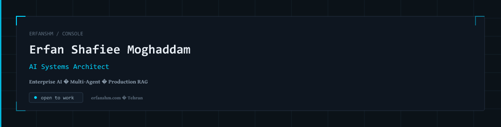
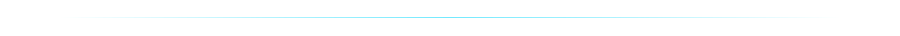
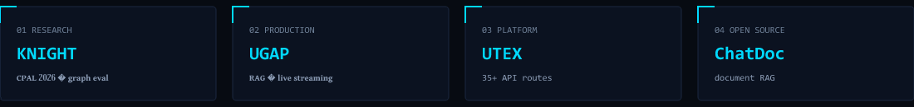

<!--
  ErfanShm Profile README
  Moderate console top (cyan HUD) + live pulse charts
  Accent: #00d9ff
-->

<p align="center">
  
</p>

<p align="center">
  <a href="https://erfanshm.com"></a>
  <a href="mailto:erfanshm12@gmail.com"></a>
  <a href="https://www.linkedin.com/in/erfan-shafiee-moghadam-"></a>
  
</p>

<p align="center">
  
</p>

<p align="center">
  
</p>

### about

I turn complex AI concepts into **enterprise-ready products** — Production RAG, multi-agent workflows, and knowledge graphs that ship (UGAP, UTEX, KNIGHT).

Open to agent, RAG, and backend automation work · Tehran · Hybrid / Remote

<p align="center">
  
</p>

### selected work

<p align="center">
  
</p>

<p align="center">
  <a href="https://github.com/ErfanShm/knight-mcq"></a>
  <a href="https://github.com/ErfanShm/ChatDoc"></a>
  <a href="https://erfanshm.com"></a>
</p>

<details>
<summary>more ships</summary>
<br/>

- [Sentiment & Emotion App](https://github.com/ErfanShm/sentiment-emotion-analysis-app)
- More on [erfanshm.com](https://erfanshm.com)

</details>

<p align="center">
  
</p>

### career

```text
2025–2026  AI Engineer & RAG Architect     @ MemaranSoft
2024–2026  AI Software Developer           @ SmartEra Organization
2024       GenAI Intern                    @ Asr Gooyesh Pardaz
2021–2023  System Analyst & Front-End Dev  @ Barsa Novin Ray & Rismun
```

<details>
<summary>expand roles</summary>
<br/>

**MemaranSoft** — UGAP (7+ vector collections, WebSocket streaming) · UTEX (35+ endpoint gateway, billing, RBAC)

**SmartEra** — Neo4j fact-checking KG · prompt optimizer · LangGraph · n8n/Zapier

**Asr Gooyesh** — Telegram/Bale RAG bots · pip sentiment package

**Research** — [KNIGHT](https://github.com/ErfanShm/knight-mcq) · CPAL 2026 · arXiv:2602.20135 · B.S. Software Eng (ATU)

</details>

<p align="center">
  
</p>

### toolchain

<p align="center">
  
</p>

<p align="center">
  
  
  
  
  
  
</p>

<p align="center">
  
</p>

### pulse

<p align="center">
  
  
</p>

<p align="center">
  
</p>

<p align="center">
  
</p>

<p align="center">
  
  
</p>

<p align="center">
  <picture>
    <source media="(prefers-color-scheme: dark)" srcset="https://raw.githubusercontent.com/ErfanShm/ErfanShm/output/github-contribution-grid-snake-dark.svg" />
    <source media="(prefers-color-scheme: light)" srcset="https://raw.githubusercontent.com/ErfanShm/ErfanShm/output/github-contribution-grid-snake.svg" />
    
  </picture>
</p>

<p align="center">
  
</p>

### connect

<p align="center">
  <a href="https://erfanshm.com"></a>
  <a href="https://www.linkedin.com/in/erfan-shafiee-moghadam-"></a>
  <a href="https://huggingface.co/ErfanShm"></a>
  <a href="https://www.kaggle.com/erfanshafieeaa"></a>
  <a href="https://medium.com/@erfanshm12"></a>
  <a href="mailto:erfanshm12@gmail.com"></a>
</p>

<p align="center">
  <sub>© 2026 · <a href="https://erfanshm.com">erfanshm.com</a> · where AI meets product · accent <code>#00d9ff</code></sub>
</p>
