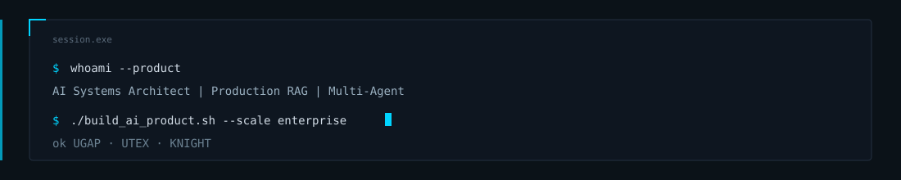
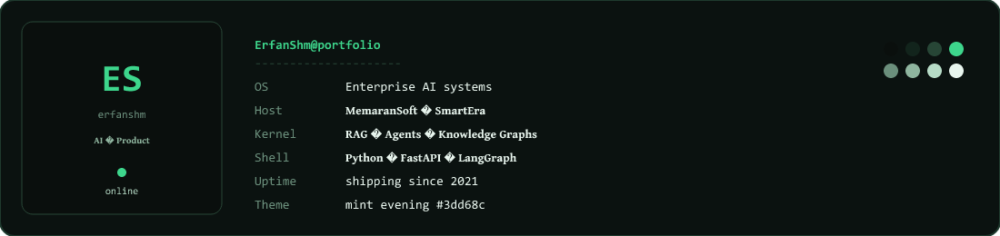
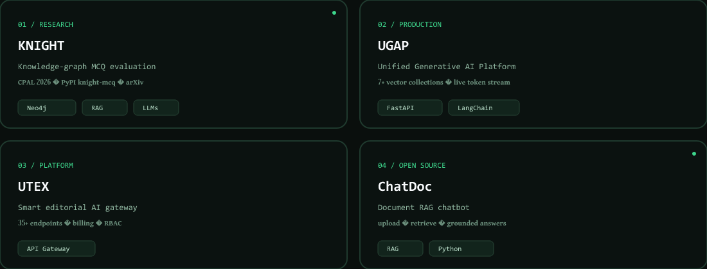

<!--
  ErfanShm Profile README
  Hybrid: terminal session reel + neofetch identity + bento work + live pulse
  Brand mint: #3dd68c · no template clone
-->

<!-- ========== HERO ========== -->
<p align="center">
  
</p>

<p align="center">
  <a href="https://erfanshm.com"></a>
  <a href="mailto:erfanshm12@gmail.com"></a>
  <a href="https://www.linkedin.com/in/erfan-shafiee-moghadam-"></a>
  
</p>

<p align="center">
  
</p>

<p align="center">
  
</p>

<!-- ========== SESSION REEL (dev-reel energy, custom script) ========== -->
<p align="center">
  
</p>

<!-- ========== IDENTITY (neofetch × product) ========== -->
<p align="center">
  
</p>

I turn complex AI concepts into **enterprise-ready products** — Production RAG, multi-agent workflows, and knowledge graphs that ship (UGAP, UTEX, KNIGHT).

<p align="center">
  
</p>

<!-- ========== BENTO WORK ========== -->
### selected work

<p align="center">
  
</p>

<p align="center">
  <a href="https://github.com/ErfanShm/knight-mcq"></a>
  <a href="https://github.com/ErfanShm/ChatDoc"></a>
  <a href="https://erfanshm.com"></a>
</p>

<details>
<summary><strong>more ships</strong> · Sentiment app · Hooshews · Smarties · Excel tools</summary>
<br/>

- [Sentiment & Emotion App](https://github.com/ErfanShm/sentiment-emotion-analysis-app) — DistilBERT + Streamlit/Gradio
- Full case studies on [erfanshm.com](https://erfanshm.com)

</details>

<p align="center">
  
</p>

<!-- ========== CAREER (compact terminal log) ========== -->
### career.log

```bash
2025–2026  AI Engineer & RAG Architect     @ MemaranSoft
2024–2026  AI Software Developer           @ SmartEra Organization
2024       GenAI Intern                    @ Asr Gooyesh Pardaz
2021–2023  System Analyst & Front-End Dev  @ Barsa Novin Ray & Rismun
```

<details>
<summary><strong>expand roles</strong></summary>
<br/>

**MemaranSoft** — UGAP (7+ vector collections, WebSocket streaming) · UTEX (35+ endpoint gateway, billing, RBAC)

**SmartEra** — Neo4j fact-checking KG · prompt optimizer · LangGraph agents · n8n/Zapier

**Asr Gooyesh** — Telegram/Bale RAG bots · pip sentiment package · FastAPI/Gradio UIs

**Research** — [KNIGHT](https://github.com/ErfanShm/knight-mcq) · CPAL 2026 · `arXiv:2602.20135` · B.S. Software Eng (ATU)

</details>

<p align="center">
  
</p>

<!-- ========== STACK ========== -->
### toolchain

<p align="center">
  
</p>

<p align="center">
  
  
  
  
  
  
</p>

<p align="center">
  
</p>

<!-- ========== PULSE (lean live widgets) ========== -->
### pulse

<p align="center">
  
  
</p>

<p align="center">
  
</p>

<p align="center">
  
</p>

<p align="center">
  
  
</p>

<p align="center">
  <picture>
    <source media="(prefers-color-scheme: dark)" srcset="https://raw.githubusercontent.com/ErfanShm/ErfanShm/output/github-contribution-grid-snake-dark.svg" />
    <source media="(prefers-color-scheme: light)" srcset="https://raw.githubusercontent.com/ErfanShm/ErfanShm/output/github-contribution-grid-snake.svg" />
    
  </picture>
</p>

<p align="center">
  
</p>

<!-- ========== CONNECT ========== -->
### connect

<p align="center">
  <a href="https://erfanshm.com"></a>
  <a href="https://www.linkedin.com/in/erfan-shafiee-moghadam-"></a>
  <a href="https://huggingface.co/ErfanShm"></a>
  <a href="https://www.kaggle.com/erfanshafieeaa"></a>
  <a href="https://medium.com/@erfanshm12"></a>
  <a href="mailto:erfanshm12@gmail.com"></a>
</p>

<p align="center">
  
</p>

<p align="center">
  <sub>© 2026 · <a href="https://erfanshm.com">erfanshm.com</a> · where AI meets product · brand <code>#3dd68c</code></sub>
</p>
