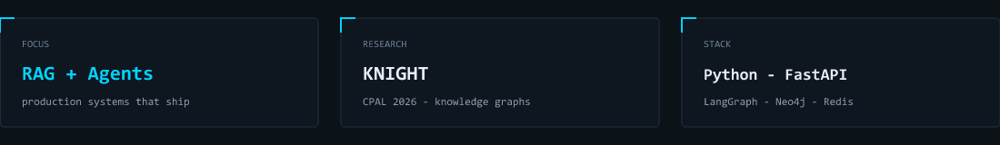

<!--
  ErfanShm Profile README
  Moderate console aesthetic · cyan #00d4ff · light HUD cues (not full cyberpunk)
-->

<p align="center">
  
</p>

<p align="center">
  <a href="https://erfanshm.com"></a>
  <a href="https://www.linkedin.com/in/erfan-shafiee-moghadam-"></a>
  <a href="mailto:erfanshm12@gmail.com"></a>
  
</p>

<p align="center">
  
</p>

<p align="center">
  
</p>

<p align="center">
  
</p>

<p align="center">
  
</p>

I design **Production RAG** and multi-agent systems that solve real business problems — UGAP, UTEX, and [KNIGHT](https://github.com/ErfanShm/knight-mcq) (CPAL 2026).

### selected work

| | Project | Notes |
|:-:|:--------|:------|
| 01 | **[KNIGHT](https://github.com/ErfanShm/knight-mcq)** | Knowledge-graph MCQ eval · PyPI · arXiv:2602.20135 |
| 02 | **UGAP** | Production RAG · 7+ collections · WebSocket streaming |
| 03 | **UTEX** | Editorial AI gateway · 35+ endpoints · billing / RBAC |
| 04 | **[ChatDoc](https://github.com/ErfanShm/ChatDoc)** | Document RAG chatbot |

<p align="center">
  <a href="https://erfanshm.com"></a>
</p>

### career

```text
2025–2026  AI Engineer & RAG Architect     · MemaranSoft
2024–2026  AI Software Developer           · SmartEra
2024       GenAI Intern                    · Asr Gooyesh Pardaz
2021–2023  System Analyst & Front-End      · Barsa / Rismun
```

<details>
<summary>details</summary>
<br/>

**MemaranSoft** — UGAP + UTEX architecture  
**SmartEra** — Neo4j fact-checking · LangGraph · prompt systems  
**Education** — B.S. Software Engineering, ATU · GPA 3.5

</details>

### stack

<p align="center">
  
</p>

<p align="center">
  
  
  
  
</p>

### pulse

<p align="center">
  
  
</p>

<p align="center">
  
</p>

<p align="center">
  <picture>
    <source media="(prefers-color-scheme: dark)" srcset="https://raw.githubusercontent.com/ErfanShm/ErfanShm/output/github-contribution-grid-snake-dark.svg" />
    <source media="(prefers-color-scheme: light)" srcset="https://raw.githubusercontent.com/ErfanShm/ErfanShm/output/github-contribution-grid-snake.svg" />
    
  </picture>
</p>

### connect

<p align="center">
  <a href="https://erfanshm.com"></a>
  <a href="https://www.linkedin.com/in/erfan-shafiee-moghadam-"></a>
  <a href="https://huggingface.co/ErfanShm"></a>
  <a href="https://www.kaggle.com/erfanshafieeaa"></a>
  <a href="mailto:erfanshm12@gmail.com"></a>
</p>

<p align="center">
  <sub>© 2026 · <a href="https://erfanshm.com">erfanshm.com</a> · open to agent / RAG / automation work</sub>
</p>
